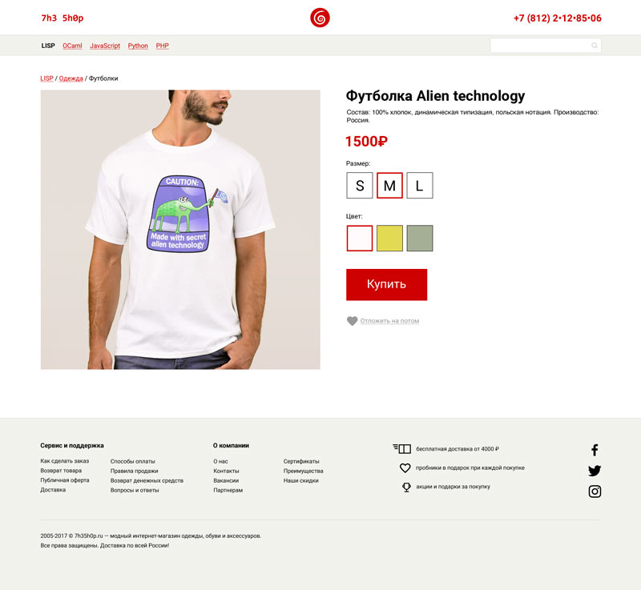

# Верстка макета "7h3 5h0p"
Вы разрабатываете интернет-магазин «7h3 5h0p» по продаже футболок для любителей языков программирования. Вам нужно сверстать страницу товара:

Сверстайте страницу, реализуйте переключение цветов.

Макет должен быть адаптивным (хорошо выглядеть на телефоне, планшете, телевизоре, экране ноутбука или десктопа). Дизайнер нарисовал только макет для десктопа, остальное вам нужно додумать самим.

Файлы макета, иконки и картинки футболок разных цветов лежат в [архиве](https://www.dropbox.com/s/vbjd1bu4ntwl6cl/mockup_the_shop.zip?dl=0).

Код нужно выложить в репозиторий на Гитхабе, в ветку `master`. На стадии разработки мы работаем с `master`, позже, при внесении изменений, будут создаваться соответствующие ветки.

Шрифт — [Roboto](https://fonts.google.com/specimen/Roboto).

За основу проекта возьмите [вот эту сборку](https://github.com/oggetto-academy/simple-html-template). Скачайте себе и запустите по инструкции (файл `README.md`). В сборке есть компилятор LESS и автоперезагрузка страницы при изменении HTML, LESS или JS файлов.

В файле `media.less` есть готовые медиа-запросы для работы с адаптивностью. Используйте их, можете добавить свои. В файле `main.less` есть пример использования.

## Требования
* Используйте [БЭМ](https://ru.bem.info/methodology/) для именования структурных элементов страницы.
* Подключите [Normalize.css](https://necolas.github.io/normalize.css/), чтобы все браузеры имели одинаковую основу для ваших стилей.
* Используйте LESS. Чтобы разобраться, прочитайте небольшой [учебник](https://mrmlnc.gitbooks.io/less-guidebook-for-beginners/content/).
* Макет должен хорошо работать в Хроме последней версии. Используйте [инструменты разработчика](https://developers.google.com/web/tools/chrome-devtools/device-mode/) для эмуляции разных девайсов.
* Библиотеки и фреймворки запрещены. Нельзя использовать Bootstrap, нельзя использовать jQuery. Ничего нельзя использовать, только HTML, LESS/CSS и JS.

<!-- Небольшое пояснительное видео к сборке: -->

<!-- <iframe width="560" height="315" src="https://www.youtube.com/embed/zOs5rsff_Pg" frameborder="0" allowfullscreen></iframe> -->

## Непрерывная интеграция Travis CI и GitHub Pages
Проект в разработке и на поддержке нужно постоянно обновлять. Причем делать это нужно так, чтобы случайно не сломать то, что уже работает. При этом желательно свести человеческий фактор к минимуму и автоматизировать все, что можно автоматизировать.

Настройте [непрерывную интеграцию Travis и GitHub](https://docs.travis-ci.com/user/deployment/pages/) для этого проекта. Схема ее работы выглядит так:

 

<!-- Видео с инструкцией: -->

<!-- <iframe width="560" height="315" src="https://www.youtube.com/embed/FS9xHYxTQ3k?rel=0&amp;controls=0&amp;showinfo=0" frameborder="0" allowfullscreen></iframe> -->
